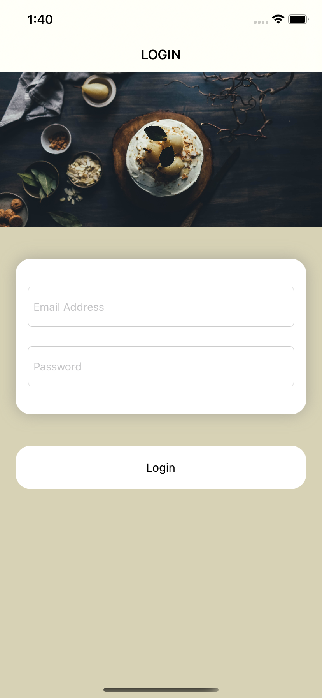
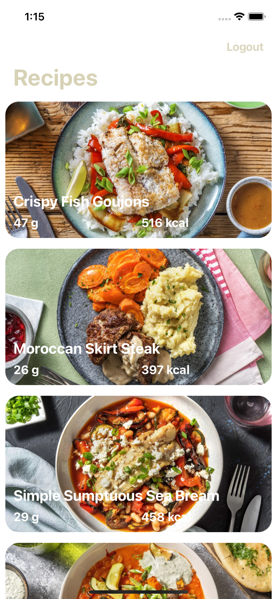
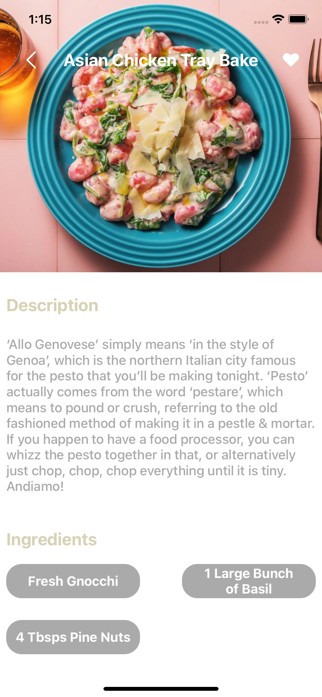

# RecipeApp
Show a list of recipes  and a recipe details screen. It follows MVVM-C software design pattern.

## Important Notes
● The app support minimum iOS 13 Or above.

● Due to  no server/API for login feature, email and password are be hardcoded for two users to check favorite feature separately.
  - First user (email: ahmed@gmail.com, password: 12345678).
  - Second user (email: ali@gmail.com, password: 87654321).

● (Realm - kingfisher) dependencies installed via swift package manager.

## Used Libraries

  ● Realm
  
  ● kingfisher
  
  ● Swift Lint

  ● SwiftGen
  
## Features
- `MVVM-C` architecture design pattern.
- Separate networking layer using `URLSession`.
- Compile-time checking for correct API endpoint accesses.
- Separate database layer using `Realm`.
- `SwiftLint` for code styling.
- `SwiftGen` for code generation.
- Unit testing.
- 
## App Screens
 

